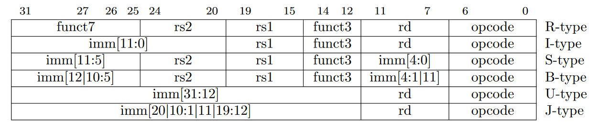
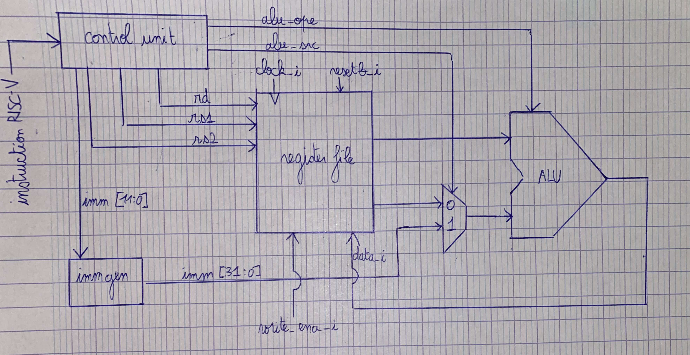
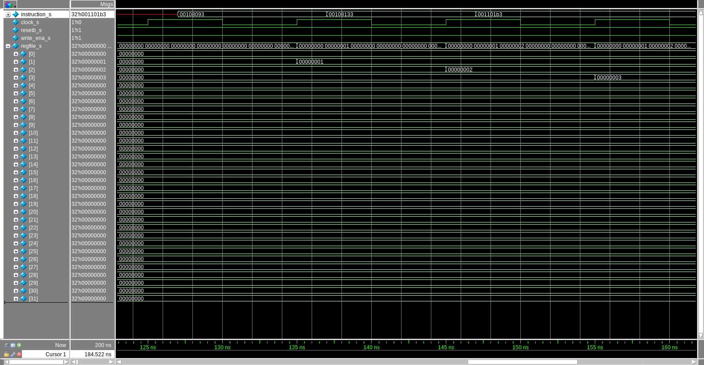

# RISC-V-processor-System-Verilog
## Types d'instructions en RISC-V :

- **rs2**=adresse du registre source 2
- **rs1**=adresse du registre source 1
- **rd**=adresse du registre de destination
- **imm[11:0]**=valeur sur 12 bits (extention signée avec imm_gen pour l'avoir sur 32bits)
- **opcode**=type d'instruction
## Version 1:
Dans cette première version, j'ai choisi de faire simple. En effet l'unité de contrôle ne prendra en entrée que des instructions ADD ou ADDI. C'est pourquoi l'ALU ne fait que l'opération "+" pour l'instant. Le banc de registre contient 32 registres de 32 bits.
### Plan du processeur:

### Testbench :
- **ADDI h'00108093** *mettre la valeur 1 dans le registre 1*    
- **ADD h'00108133** *mettre le double de la valeur du registre 1 dans le registre 2*  
- **ADD h'001101b3** *mettre la somme des valeurs des registres 1 et 2 dans le registre 3*
### Waves de la simulation avec Modelsim :

